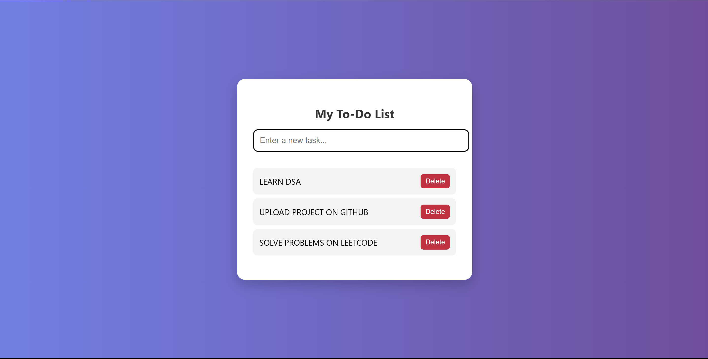

# 📝 Animated To-Do List

A simple, beautiful and animated To-Do List built using **HTML**, **CSS**, and **JavaScript**. This is a beginner-friendly project that helps practice DOM manipulation and basic UI/UX design concepts.

## 🚀 Features

- Add new tasks by pressing `Enter`
- Remove tasks with a single click
- Smooth animations for adding and deleting tasks
- Fully responsive and mobile-friendly UI

## 🔧 Technologies Used

- HTML5
- CSS3 (with animations)
- JavaScript (Vanilla)

## 📸 Preview

 <!-- Add a screenshot and name it preview.png -->

## 💻 Getting Started

To run the project locally:

1. Clone the repository:
   ```bash
   git clone https://github.com/yourusername/your-repo-name.git
